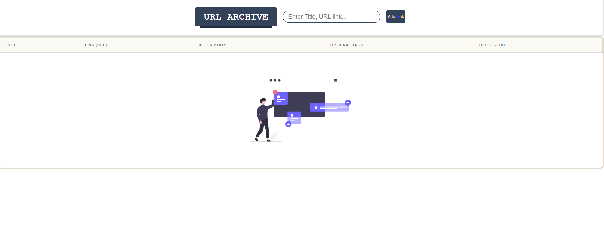

<h1 align="center">Task 2 - BookMark link vault</h1>


<p>My application is called URL Archive. The task is about testing ability to build a complete, functional web application using React with TypeScript, handling data persistence and responsive design, while maintaining good code quality and UX principles.</p>

<p align="center">
  
  
  
  
</p>


---

<p align="center">
  <a href="https://www.youtube.com/watch?v=yEhk3ujX8sE">
     
    OnlineITtuts Tutorials
  </a>
</p>

---

## Screenshot 
<p align="center">
  
</p>

## System Features

### CRUD Operations

| Operation | Description |
|-----------|-------------|
| **Create** | Store links with Title, URL, Description, and Tags |
| **Read** | Visual layouts to scan saved links |
| **Update** | Seamlessly update link fields dynamically |
| **Delete** | Instantly remove outdated links |

### Multi-Field Global Search Engine

Filters content based on:
- Customized Tags
- Destination URLs
- Item Descriptions
- Document Titles

### Native Responsive Design

Supports all standard breakpoints:
- **320px/480px** - Mobile devices
- **768px** - Tablets
- **1024px** - Laptops
- **1200px** - Desktops

## Technologies Used

### Frontend
- **React 18+** - UI library with hooks and functional components
- **TypeScript** - Type-safe JavaScript for better maintainability
- **CSS3** - Custom styling with responsive design
- **Vite** - Next-generation build tool for faster development

### Data Management
- **LocalStorage API** - Client-side data persistence
- **React Hooks** - State management (useState, useEffect, useContext)

#### Development Tools
- **Prettier** - Code formatting
- **Git** - Version control

## Installation & Setup
### Prerequisites 
- Node.js (v16.0.0 or higher)
- npm or yarn package manager

### Steps to Run Locally

```bash
# Clone the repository
git clone https://github.com/NeeloByron/Task-2-ReactTS-Links-Vault.git
```

```bash
# Install dependencies
npm install
```

```bash
# Start development server
npm run dev
```

```bash
# Build for production
npm run build
```

```bash
# Preview production build
npm run preview
```

